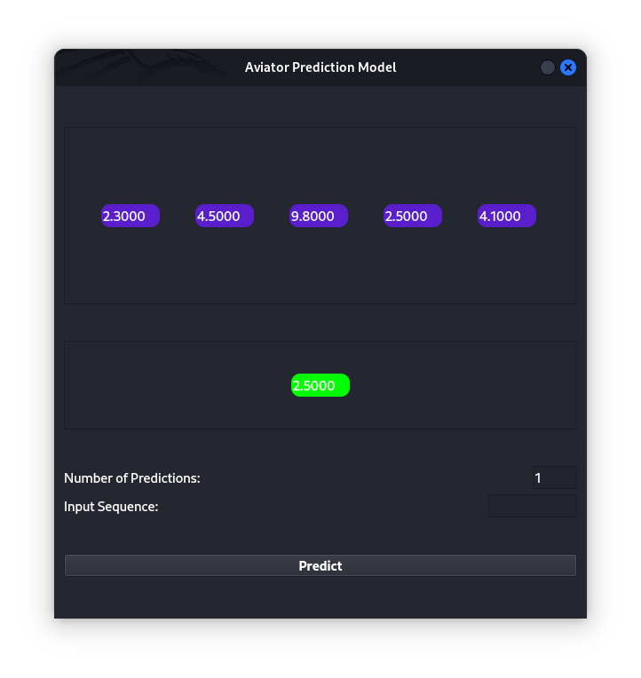

# Aviator Prediction Model

The Aviator Prediction Model is a graphical user interface (GUI) application for making predictions using a linear regression model. It allows users to input sequences of numerical data, train a linear regression model based on the input data, and make predictions for future values.

## Installation

To use the Aviator Prediction Model, follow these steps:

1. Clone the repository to your local machine:

    ```
    git clone https://github.com/phantom-kali/AviatorPredictionModel.git
    ```

2. Navigate to the project directory:

    ```
    cd AviatorPredictionModel
    ```

3. Install the required dependencies:

    ```
    pip install -r requirements.txt
    ```

## Usage

Once the installation is complete, you can run the application by executing the following command:

  ```
  python main.py
  ```

This will launch the GUI application, where you can input sequences of numerical data and make predictions.

### Inputting Data

- To input a numerical value, type the value into the "Input Sequence" field and press Enter.
- The input sequence will be displayed in the history area of the GUI.

### Making Predictions

- To make predictions, enter the desired number of predictions into the "Number of Predictions" field.
- Click the "Predict" button to generate predictions based on the input sequence.
- The predicted values will be displayed in the predictions area of the GUI.

### Notes

- The Aviator Prediction Model requires at least three numerical values to make predictions.
- Predictions are made using a linear regression model trained on the input data.

## Contributing

If you'd like to contribute to the Aviator Prediction Model, please follow these steps:

1. Fork the repository on GitHub.
2. Create a new branch for your feature or bug fix.
3. Make your changes and commit them to your branch.
4. Push your changes to your fork.
5. Create a pull request to merge your changes into the main repository.

## License

The Aviator Prediction Model is licensed under the MIT License. See the [LICENSE](LICENSE) file for details.
